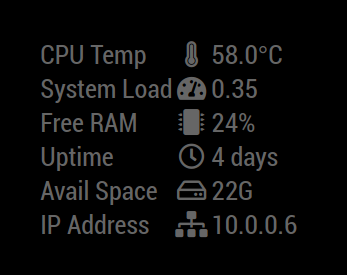

# Module: MMM-SystemStats


This [MagicMirror²](https://github.com/MichMich/MagicMirror) module, shows the processor temperature, system load, available RAM, uptime and free disk space.



Forked from [BenRoe](https://github.com/BenRoe) and encorporated changes made or inspired by various pull requests.

## Installation

Navigate into your MagicMirror's `modules` folder and clone:

```sh
git clone https://github.com/shin10/MMM-SystemStats
```

## Using the module

To use this module, add it to the modules array in the `config/config.js` file:

```javascript
modules: [
  {
    module: "MMM-SystemStats",
    position: "top_center", // This can be any of the regions.
    config: {
      updateInterval: 10000,
      animationSpeed: 0,
      align: "right",
      alignText: null,
      alignIcon: null,
      alignValue: null,
      language: config.language,
      units: config.units,
      useSyslog: false,
      thresholdCPUTemp: 75, // in configured units
      baseURLSyslog: "http://127.0.0.1:8080/syslog",
      label: "textAndIcon",
      layout: "table",
      statItems: [
        "cpuTemp",
        "sysLoad",
        "freeMem",
        "upTime",
        "freeSpace",
        "ipAddress"
      ]
    }
  }
];
```

## Configuration options

The following properties can be configured:

| Option             | Default                                                             | Expected                                                                        | Description                                                                                                       |
| ------------------ | ------------------------------------------------------------------- | ------------------------------------------------------------------------------- | ----------------------------------------------------------------------------------------------------------------- |
| `updateInterval`   | `10000` (10 seconds)                                                | `1000` - `86400000`                                                             | How often does the content needs to be fetched? (Milliseconds)                                                    |
| `animationSpeed`   | `0` (animation off)                                                 | `0` - `5000`                                                                    | Speed of the update animation. (Milliseconds)                                                                     |
| `align`            | `right`                                                             | `left`, `right`, `center`                                                       | Align the text.                                                                                                   |
| `alignText`        | `null`                                                              | `left`, `right`, `center`                                                       | Align the labels.                                                                                                 |
| `alignIcon`        | `null`                                                              | `left`, `right`, `center`                                                       | Align the icons.                                                                                                  |
| `alignValue`       | `null`                                                              | `left`, `right`, `center`                                                       | Align the values.                                                                                                 |
| `language`         | `config.language`                                                   |                                                                                 | language id for text can be different from MM.                                                                    |
| `units`            | `config.units`                                                      | `config.units`, `default` = Kelvin, `metric` = Celsius, `imperial` = Fahrenheit | What units to use.                                                                                                |
| `useSyslog`        | `false`                                                             |                                                                                 | log event to MMM-syslog?                                                                                          |
| `thresholdCPUTemp` | `70`                                                                |                                                                                 | upper-threshold for CPU Temp. If CPU Temp is more than this value, log to MMM-syslog if useSyslog=true. (Celsius) |
| `baseURLSyslog`    | `http://127.0.0.1:8080/syslog`                                      |                                                                                 | URL base of [MMM-syslog module](https://github.com/paviro/MMM-syslog")                                            |
| `label`            | `textAndIcon`                                                       | `textAndIcon`, `text` or `icon`                                                 | Show text labels with icons, only text, or only icons.                                                            |
| `layout`           | `table`                                                             | `table` or `single-line`                                                        | Set the single-line or table layout.                                                                              |
| `statItems`        | [ "cpuTemp", "sysLoad", "freeMem","upTime","freeSpace","ipAddress"] | `textAndIcon`, `text` or `icon`                                                 | List of statistic items to show and define the order.                                                             |

## ToDo

- better indication for the system load
